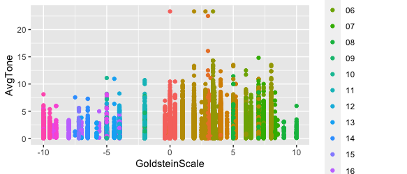

# MongoHackathon2022
What is all this?  Using data analysis on GDELT data

## How to obtain the GDELT event data
* Use the gdettools script  to load as zip files from the GDELT
* Use this jar file to load directly from bigquery then use the Mongodb Data api to load to atlas

# Loading directly from BigQuery and loading to Atlas with the 

# Using R and ggplot with Atlas and GDELT [Atlas Data Api](https://www.mongodb.com/docs/atlas/api/data-api)
On the Atlas side the Data Api can be turned on very simply after the standard creation of an authentication method

### Using the Advanced Rest Client to pull data with an HTTP POST 


## Calling BigQuery from within Kotlin code
```
        val bigquery = BigQueryOptions.getDefaultInstance().service
        val queryConfig = QueryJobConfiguration.newBuilder(
            "select $fieldList from `gdelt-bq.gdeltv2.events`  where GLOBALEVENTID > $lastId limit 2000"
        ) // Use standard SQL syntax for queries.
            // See: https://cloud.google.com/bigquery/sql-reference/
            .setUseLegacySql(false)
            .build()

```
   **Field list matches a Kotlin data class limit is obtained from  Atlas  with the Data Api using Ktor**


